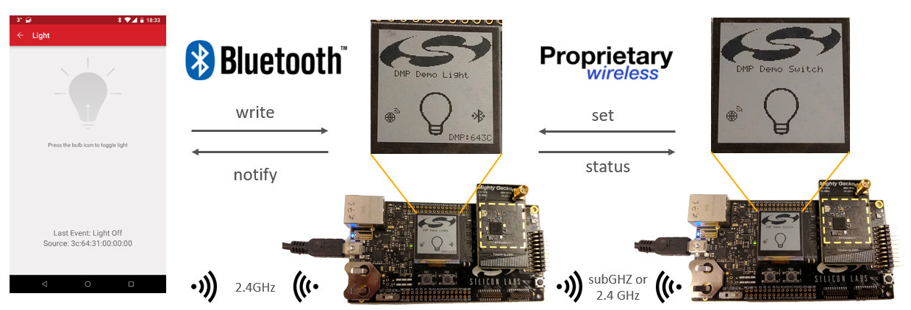
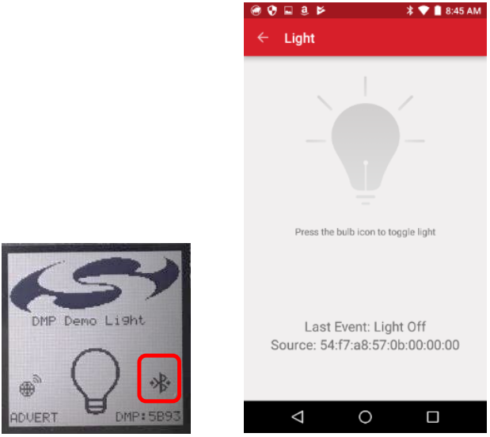
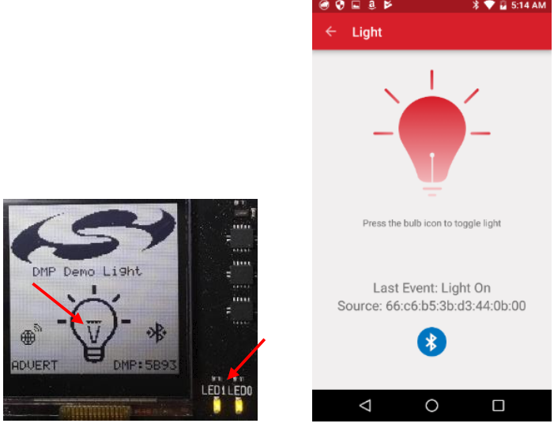
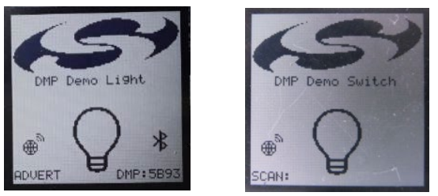
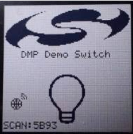
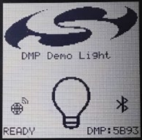
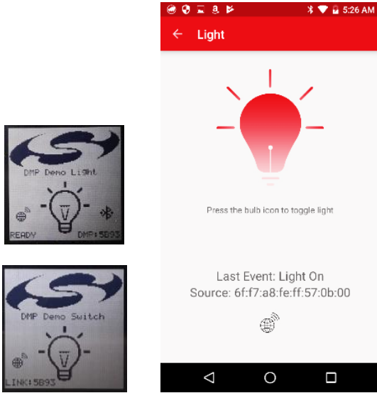
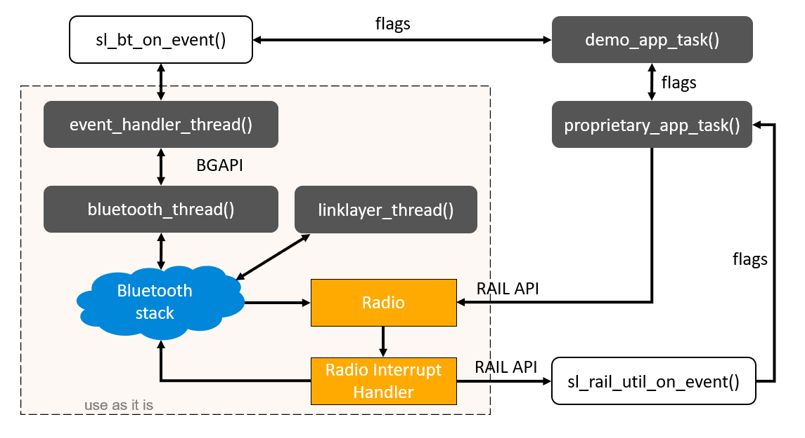

# SoC - Light RAIL DMP

This is a Dynamic Multiprotocol reference application demonstrating a light bulb that can be switched both via Bluetooth and via a Proprietary protocol. To switch it via Bluetooth, use the EFR Connect smartphone app. To switch it via a Proprietary protocol, use the **Flex (RAIL) - Switch** example.

> Note: this example expects a specific Gecko Bootloader to be present on your device. For details see the Troubleshooting section.

## Getting Started

To get started with Silicon Labs Bluetooth and Simplicity Studio, see [QSG169: Bluetooth SDK v3.x Quick Start Guide](https://www.silabs.com/documents/public/quick-start-guides/qsg169-bluetooth-sdk-v3x-quick-start-guide.pdf).

This example implements a sample project with Bluetooth Low Energy and a proprietary protocol running in parallel on the device. The project is based on a Real Time Operating System (Micrium OS or FreeRTOS according to your choice). For more information about using Real Time Operating Systems with Bluetooth, see [AN1260: Integrating v3.x Silicon Labs Bluetooth Applications with Real-Time Operating Systems](https://www.silabs.com/documents/public/application-notes/an1260-integrating-v3x-bluetooth-applications-with-rtos.pdf).

For more details about the Bluetooth and proprietary DMP applications, see [AN1269: Dynamic Multiprotocol Development with Bluetooth and Proprietary Protocols on RAIL in GSDK v3.x](https://www.silabs.com/documents/public/application-notes/an1269-bluetooth-rail-dynamic-multiprotocol-gsdk-v3x.pdf) and [UG305: Dynamic Multiprotocol User’s Guide](https://www.silabs.com/documents/public/user-guides/ug305-dynamic-multiprotocol-users-guide.pdf)

## Project Setup

The sample project implements the functionality of a remote-controlled lightbulb, which can be controlled via Bluetooth and via a Proprietary protocol. After startup, the lightbulb advertises itself on BLE and Proprietary, and, when connected, it can be controlled by both. It will send a notification when the state has been changed, with the MAC address of the device which initiated the change. The project setup consists of two WSTKs and a mobile phone, as follows:

### Controlling via Bluetooth

After flashing the Light demo on a board, it will be visible in the EFR Connect app (available on iOS and Android). Open the app on your phone, go to the Demo tab, and tap the Connected Lighting tile. Now you can connect to your device, as follows:

Both the app display and the Bluetooth icon on the light’s LCD change, which indicates a connection:

Tap the bulb icon on the smartphone app to toggle the light. The app display, the LCD display, and the LEDs all turn on. The app shows Last Event: Light On. Source is the MAC address of the device sending the command, in this case the smartphone:

Note that the light demo has two modes, Advertise (ADVERT) and READY. These are for operation by the switch device, as described next. The smartphone app toggles the light regardless of the mode.

### Controlling with the Switch

To use this example, flash the **Flex (RAIL) - Switch** example project (available in the Flex SDK) to another board. To operate the light from the RAIL Switch application, first link the two devices. The RAIL switch starts in SCAN mode to look for lights in the vicinity. The light starts in ADVERTISE mode and broadcasts its address to nearby RAIL Switches, as follows:

After a RAIL switch receives a light’s advertisement packet, it displays its short ID in the bottom left corner. If more lights are advertising at the same time, the switch displays the ID of the Light with the strongest signal, as shown in the image below:

Press PB1 on the RAIL switch to store the light’s ID and put the device into LINK mode, as shown in the image below:

Finally, press PB1 on the Light to place it into READY mode, in which it sends out the status of the light periodically and accepts toggle commands from the linked Switch, as shown in the image below:

You should now be able to toggle the light using the linked switch. Note that more than one switch can be linked to a single light, but one switch cannot control more than one light. The app shows the source as the MAC address of the switch, as shown in the image below:

Again, a briefly-displayed arrow shows the source of the command on the Light LCD, as follows:

If you press the bulb icon on the app, both the light and the switch displays change, as follows:

## Project Structure

The following image shows the overview of the software Architecture of the project.

The event handling for the different protocols can be found in their respective tasks. `sl_rail_util_on_event()` is used to handle time-critical RAIL events, and it can signal the changes to `proprietary_app_task()`, which handles non-time-critical events and also executes scheduled proprietary radio tasks. `sl_bt_on_event()` is used to handle Bluetooth events, while `demo_app_task()` is responsible for implementing the state machine of the whole application.

### Bluetooth Configuration

The Bluetooth stack can be configured via the Bluetooth Software Components (see the SOFTWARE COMPONENTS tab in the Project Configurator for the .slcp file).

The project also contains the Silabs DMP Light service in the GATT database. GATT definitions can be viewed (and extended) using the GATT Configurator, which can be found under Advanced Configurators in the Software Components tab of the Project Configurator, as shown below:

To learn how to use the GATT Configurator, see [UG438: GATT Configurator User’s Guide for Bluetooth SDK v3.x](https://www.silabs.com/documents/public/user-guides/ug438-gatt-configurator-users-guide-sdk-v3x.pdf).

The Bluetooth task creation and the stack initialization is implemented in the `sl_system_init()` function, called from the `main` function. The Bluetooth event handler function, `sl_bt_on_event`, can be found in the file *bluetooth_app.c*. This contains the Bluetooth implementation.

### Proprietary Configuration

RAIL (Radio Abstraction and Integration Layer) can be configured via the RAIL Software Components.

The proprietary protocol also needs a radio configuration. This example applies a default configuration, which works out-of-the-box, based on the radio board you use. The radio configuration can be viewed and altered in the Radio Configurator. The Radio Configurator can be found under Advanced Configurators in the Software Components tab of the Project Configurator, as shown below:

To learn how to use the Radio Configurator, see [AN1253: EFR32 Radio Configurator Guide for Simplicity Studio 5](https://www.silabs.com/documents/public/application-notes/an1253-efr32-radio-configurator-guide-for-ssv5.pdf).

The proprietary task and the event handling are implemented in *app_proprietary.c*.

### Application Tasks

The main logic of the demo application is implemented in `demo_app_task()` that can be found in *app_bluetooth.c*. You can implement additional application-specific tasks in *app.c*.

## Troubleshooting

### Bootloader Issues

Note that Example Projects do not include a bootloader. However, Bluetooth-based Example Projects expect a bootloader to be present on the device in order to support device firmware upgrade (DFU). To get your application to work, you should either 
- flash the proper bootloader or
- remove the DFU functionality from the project.

**If you do not wish to add a bootloader**, then remove the DFU functionality by uninstalling the *Bootloader Application Interface* software component -- and all of its dependants. This will automatically put your application code to the start address of the flash, which means that a bootloader is no longer needed, but also that you will not be able to upgrade your firmware.

**If you want to add a bootloader**, then either 
- Create a bootloader project, build it and flash it to your device. Note that different projects expect different bootloaders:
  - for NCP and RCP projects create a *BGAPI UART DFU* type bootloader
  - for SoC projects on Series 2 devices create a *Bluetooth Apploader OTA DFU* type bootloader

- or run a precompiled Demo on your device from the Launcher view before flashing your application. Precompiled demos flash both bootloader and application images to the device. Flashing your own application image after the demo will overwrite the demo application but leave the bootloader in place. 
  - For NCP and RCP projects, flash the *Bluetooth - NCP* demo.
  - For SoC projects, flash the *Bluetooth - SoC Thermometer* demo.

**Important Notes:** 
- when you flash your application image to the device, use the *.hex* or *.s37* output file. Flashing *.bin* files may overwrite (erase) the bootloader.

- On Series 2 devices SoC example projects require a *Bluetooth Apploader OTA DFU* type bootloader by default. This bootloader needs a lot of flash space and does not fit into the regular bootloader area, hence the application start address must be shifted. This shift is automatically done by the *Apploader Support for Applications* software component, which is installed by default. If you want to use any other bootloader type, you should remove this software component in order to shift the application start address back to the end of the regular bootloader area. Note, that in this case you cannot do OTA DFU with Apploader, but you can still implement application-level OTA DFU by installing the *Application OTA DFU* software component instead of *In-place OTA DFU*.

For more information on bootloaders, see [UG103.6: Bootloader Fundamentals](https://www.silabs.com/documents/public/user-guides/ug103-06-fundamentals-bootloading.pdf) and [UG489: Silicon Labs Gecko Bootloader User's Guide for GSDK 4.0 and Higher](https://cn.silabs.com/documents/public/user-guides/ug489-gecko-bootloader-user-guide-gsdk-4.pdf).

### Programming the Radio Board

Before programming the radio board mounted on the mainboard, make sure the power supply switch is in the AEM position (right side) as shown below.

## Resources

[Bluetooth Documentation](https://docs.silabs.com/bluetooth/latest/)

[UG103.14: Bluetooth LE Fundamentals](https://www.silabs.com/documents/public/user-guides/ug103-14-fundamentals-ble.pdf)

[QSG169: Bluetooth SDK v3.x Quick Start Guide](https://www.silabs.com/documents/public/quick-start-guides/qsg169-bluetooth-sdk-v3x-quick-start-guide.pdf)

[UG434: Silicon Labs Bluetooth ® C Application Developer's Guide for SDK v3.x](https://www.silabs.com/documents/public/user-guides/ug434-bluetooth-c-soc-dev-guide-sdk-v3x.pdf)

[AN1269: Dynamic Multiprotocol Development with Bluetooth and Proprietary Protocols on RAIL in GSDK v3.x](https://www.silabs.com/documents/public/application-notes/an1269-bluetooth-rail-dynamic-multiprotocol-gsdk-v3x.pdf)

[UG305: Dynamic Multiprotocol User’s Guide](https://www.silabs.com/documents/public/user-guides/ug305-dynamic-multiprotocol-users-guide.pdf)

[AN1260: Integrating v3.x Silicon Labs Bluetooth Applications with Real-Time Operating Systems](https://www.silabs.com/documents/public/application-notes/an1260-integrating-v3x-bluetooth-applications-with-rtos.pdf)

[Bluetooth Training](https://www.silabs.com/support/training/bluetooth)

## Report Bugs & Get Support

You are always encouraged and welcome to report any issues you found to us via [Silicon Labs Community](https://www.silabs.com/community).