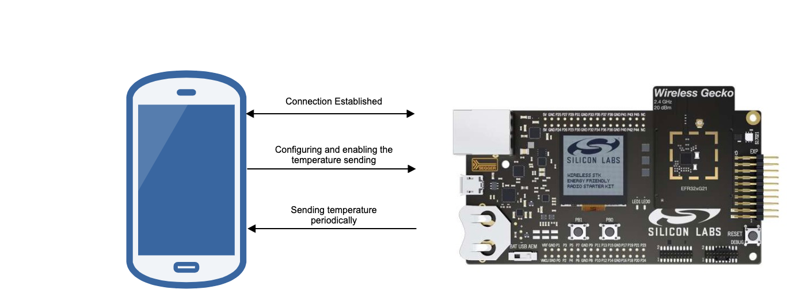
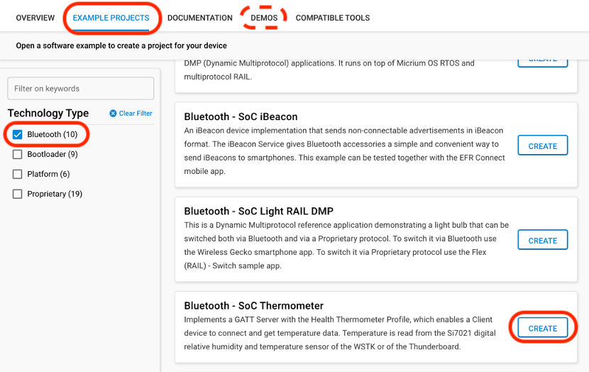
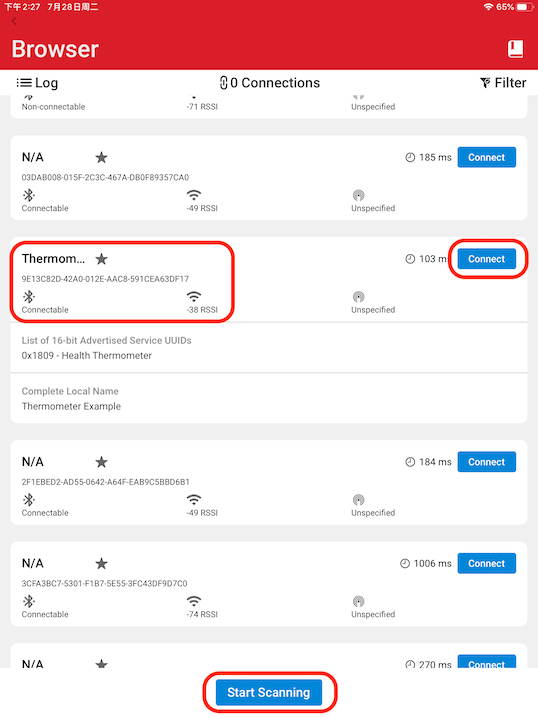
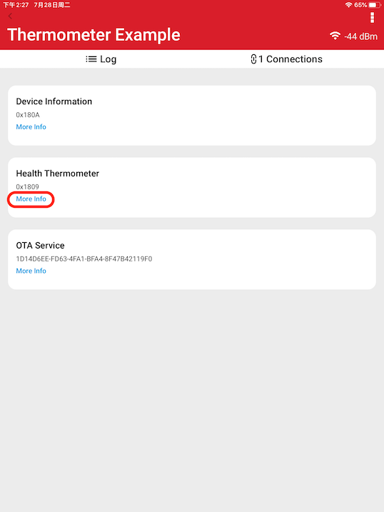
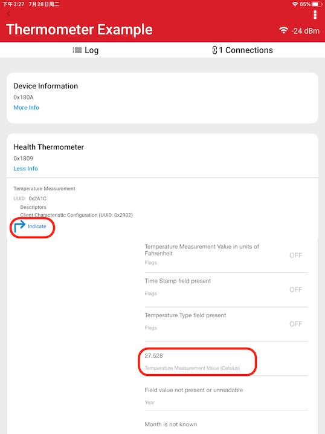

# SoC - Thermometer

This example implements the Health Thermometer service. It enables a peer device to connect and receive temperature values via Bluetooth. The reported values are measured by a temperature sensor located on the mainboard.

> Note: this example expects a specific Gecko Bootloader to be present on your device. For details see the Troubleshooting section.

## Getting Started

To get started with Silicon Labs Bluetooth and Simplicity Studio, see [QSG169: Bluetooth SDK v3.x Quick Start Guide](https://www.silabs.com/documents/public/quick-start-guides/qsg169-bluetooth-sdk-v3x-quick-start-guide.pdf).

This example implements the predefined [Thermometer Service](https://www.bluetooth.com/xml-viewer/?src=https://www.bluetooth.com/wp-content/uploads/Sitecore-Media-Library/Gatt/Xml/Services/org.bluetooth.service.health_thermometer.xml). To run this example, you will need:

- A mainboard with Bluetooth Low Energy-compatible [radio board](https://www.silabs.com/wireless/bluetooth).
- An *[iOS](https://itunes.apple.com/us/app/silicon-labs-blue-gecko-wstk/id1030932759?mt=8)* or *[Android](https://play.google.com/store/apps/details?id=com.siliconlabs.bledemo)* smartphone with EFR Connect app installed.

The following picture shows the system view of how it works.

Follow these steps to get the temperature value on your smartphone.

1. Create the soc-thermometer project based on your hardware, then build and flash the image to your board. Alternatively, you could flash the pre-built demo image.

2. Open the *EFR Connect* app on your smartphone and allow the permission requested the first time it is opened.

3. Click [Develop] -> [Browser]. You will see a list of nearby devices that are sending Bluetooth advertisement. Find the one named "Thermometer Example" and click the `connect` button on the right side.

4. Wait for the connection to establish and GATT database to be loaded, then find the *Health Thermometer* service, and click `More Info`.

5. Four characteristics will show up. Find the *Temperature Measurement* and press the `indicate` button. Then, you will see the temperature value getting updated periodically. You should also see the temperature displayed change as you press the top of the sensor with your finger, as shown below. If your board is not connected to a temperature sensor (e.g., because of a limited number of available pins), a generated value will be shown which changes 1 degree Celsius every second.

Alternatively, you can follow the steps below instead of steps 3-5 to use the Health Thermometer feature in the app. This will automatically scan and list devices advertising the Health Thermometer service and, upon connection, will automatically enable notifications and display the temperature data.

## Troubleshooting

### Bootloader Issues

Note that Example Projects do not include a bootloader. However, Bluetooth-based Example Projects expect a bootloader to be present on the device in order to support device firmware upgrade (DFU). To get your application to work, you should either 
- flash the proper bootloader or
- remove the DFU functionality from the project.

**If you do not wish to add a bootloader**, then remove the DFU functionality by uninstalling the *Bootloader Application Interface* software component -- and all of its dependants. This will automatically put your application code to the start address of the flash, which means that a bootloader is no longer needed, but also that you will not be able to upgrade your firmware.

**If you want to add a bootloader**, then either 
- Create a bootloader project, build it and flash it to your device. Note that different projects expect different bootloaders:
  - for NCP and RCP projects create a *BGAPI UART DFU* type bootloader
  - for SoC projects on Series 2 devices create a *Bluetooth Apploader OTA DFU* type bootloader

- or run a precompiled Demo on your device from the Launcher view before flashing your application. Precompiled demos flash both bootloader and application images to the device. Flashing your own application image after the demo will overwrite the demo application but leave the bootloader in place. 
  - For NCP and RCP projects, flash the *Bluetooth - NCP* demo.
  - For SoC projects, flash the *Bluetooth - SoC Thermometer* demo.

**Important Notes:** 
- when you flash your application image to the device, use the *.hex* or *.s37* output file. Flashing *.bin* files may overwrite (erase) the bootloader.

- On Series 2 devices SoC example projects require a *Bluetooth Apploader OTA DFU* type bootloader by default. This bootloader needs a lot of flash space and does not fit into the regular bootloader area, hence the application start address must be shifted. This shift is automatically done by the *Apploader Support for Applications* software component, which is installed by default. If you want to use any other bootloader type, you should remove this software component in order to shift the application start address back to the end of the regular bootloader area. Note, that in this case you cannot do OTA DFU with Apploader, but you can still implement application-level OTA DFU by installing the *Application OTA DFU* software component instead of *In-place OTA DFU*.

For more information on bootloaders, see [UG103.6: Bootloader Fundamentals](https://www.silabs.com/documents/public/user-guides/ug103-06-fundamentals-bootloading.pdf) and [UG489: Silicon Labs Gecko Bootloader User's Guide for GSDK 4.0 and Higher](https://cn.silabs.com/documents/public/user-guides/ug489-gecko-bootloader-user-guide-gsdk-4.pdf).

### Programming the Radio Board

Before programming the radio board mounted on the mainboard, make sure the power supply switch is in the AEM position (right side) as shown below.

## Resources

[Bluetooth Documentation](https://docs.silabs.com/bluetooth/latest/)

[UG103.14: Bluetooth LE Fundamentals](https://www.silabs.com/documents/public/user-guides/ug103-14-fundamentals-ble.pdf)

[QSG169: Bluetooth SDK v3.x Quick Start Guide](https://www.silabs.com/documents/public/quick-start-guides/qsg169-bluetooth-sdk-v3x-quick-start-guide.pdf)

[UG434: Silicon Labs Bluetooth ® C Application Developer's Guide for SDK v3.x](https://www.silabs.com/documents/public/user-guides/ug434-bluetooth-c-soc-dev-guide-sdk-v3x.pdf)

[Bluetooth Training](https://www.silabs.com/support/training/bluetooth)

[Bluetooth SIG thermometer profile specification](https://www.bluetooth.org/docman/handlers/downloaddoc.ashx?doc_id=238687&_ga=2.28821308.120082263.1538382903-201228904.1529395147)

## Report Bugs & Get Support

You are always encouraged and welcome to report any issues you found to us via [Silicon Labs Community](https://www.silabs.com/community).