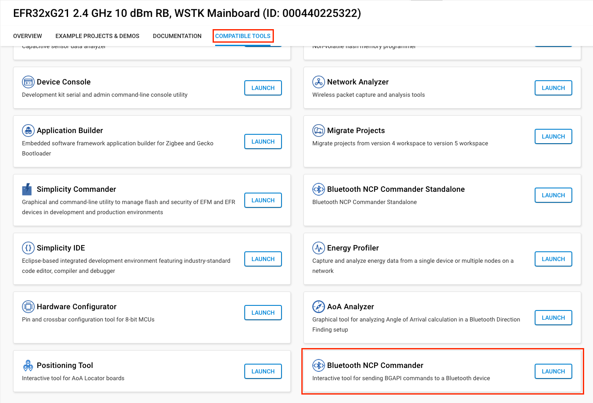
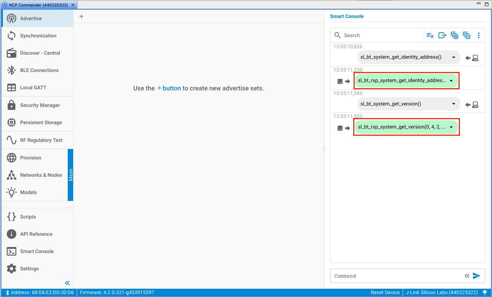
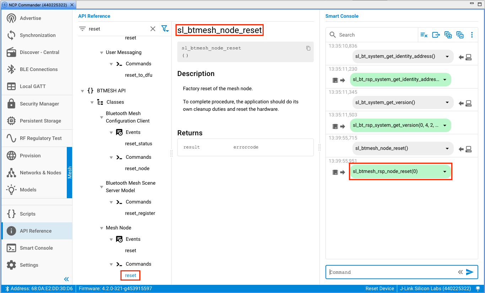
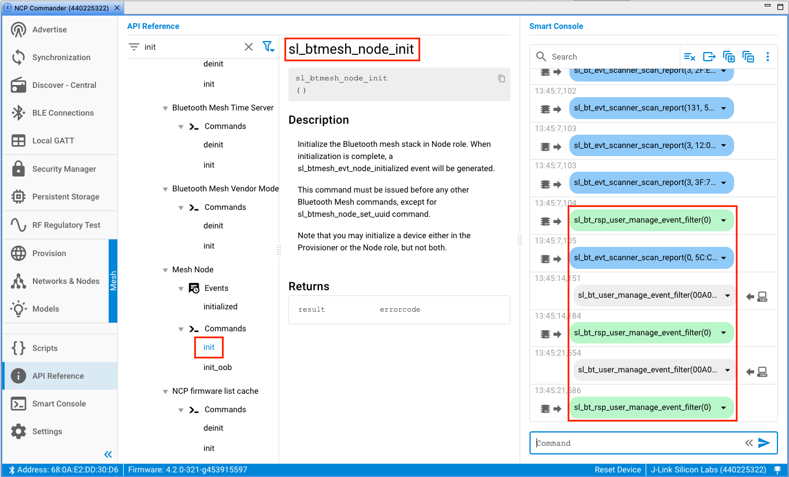
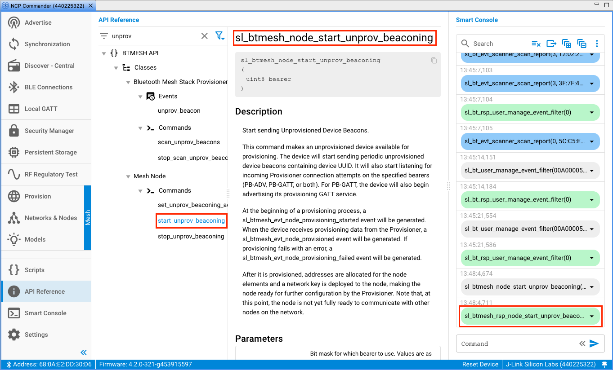

# Bluetooth Mesh - NCP Empty

At times design constraints drive the need to run the application on a separated host and have the Bluetooth stack running on a dedicated target. This configuration of the stack is called the Network Co-Processor (NCP) mode. NCP mode is illustrated here with the **Bluetooth Mesh - NCP Empty** example application and NCP Commander used as a host application.

**Bluetooth Mesh - NCP Empty** demonstrates the bare minimum needed for a Bluetooth mesh NCP Target C application to make it possible for the NCP Host Controller to access the Bluetooth mesh stack via UART. It provides access to the host layer via BGAPI and not to the link layer via HCI. The communication between the Host Controller and the target can be secured by installing the Secure NCP component. The example requires the BGAPI UART DFU Bootloader.

## Getting Started

To get started with Silicon Labs Bluetooth software and Simplicity Studio, see [QSG176: Bluetooth Mesh SDK v2.x Quick Start Guide](https://www.silabs.com/documents/public/quick-start-guides/qsg176-bluetooth-mesh-sdk-v2x-quick-start-guide.pdf).

In the NCP context, the application runs on a host MCU or PC, which is called the NCP Host, while the Bluetooth stack runs on an EFR32, which is called the NCP Target. 

The NCP Host and Target communicate via a serial interface (UART) or, if a mainboard is used, optionally via TCP/IP connection. The communication between the NCP Host and Target is defined in the Silicon Labs proprietary protocol called BGAPI. BGLib is the C reference implementation of the BGAPI protocol, which is to be used on the NCP Host side.

[AN1259: Using the v3.x Silicon Labs Bluetooth Stack in Network CoProcessor Mode](https://www.silabs.com/documents/public/application-notes/an1259-bt-ncp-mode-sdk-v3x.pdf) provides a detailed description how NCP works and how to configure it for your custom hardware.

The following figures show the system view of NCP mode.

## Evaluating with Bluetooth NCP Commander

NCP Commander can be used to control the target and test NCP firmware without developing your own host application. In Simplicity Studio, browse to the Launcher -> Compatible Tools tab and open NCP Commander. A shortcut to the Compatible Tools can also be found on the top toolbar. Follow these steps to make the NCP target advertise.

1. Connect your board to a PC via USB and start NCP Commander from Simplicity Studio.

2. Choose your board from the list and click "Connect".

3. The NCP host will try to get the Bluetooth address and firmware version from the NCP target. If it succeeds, the connection is established.

4. Upon connection to the NCP target, you must initialize the node in order for it to emit unprovisioned beacons and then be provisioned. To make sure the device starts from a clean state, do a factory reset to erase the NVM information, as illustrated below, using the `sl_btmesh_node_reset()` command:

5. Once you have factory-reset the node, you can initialize the stack as a node by calling the initializing routine `sl_btmesh_node_init()`. In the API help menu, select the corresponding routine, copy it in the command field and send it. You can now see the device scanning. If you want to prevent the device scanning (as the display may be flooded with the scan response messages), you can also call `sl_bt_user_manage_event_filter(00 A0 00 05 00)`, `sl_bt_user_manage_event_filter(00 A0 00 05 01)` and `sl_bt_user_manage_event_filter(00 A0 00 05 02)` to block all the Bluetooth LE scan reports. This can be called even before the node initialization.

6. Once the device stack is initialized as a node, you can start sending unprovisioned beacons. This can be done by calling the routine using the value 0x3 for both advertising and GATT bearers like this `sl_btmesh_node_start_unprov_beaconing(0x3)`:

7. Open the Silicon Labs Bluetooth Mesh application to see your device advertising as "Silabs Example". You may also connect to the device and discover its GATT database.

## NCP Host examples

In addition to **Bluetooth NCP Commander**, Silicon Labs also provides NCP Host examples with source code.

A C project is in the SDK folder `app/btmesh/example_host/empty_btmesh`

A pyBGAPI based Python project can be found in the [SiliconLabs / pybgapi-examples](https://github.com/SiliconLabs/pybgapi-examples) GitHub repository.

For more information, see [AN1259: Using the v3.x Silicon Labs Bluetooth Stack in Network CoProcessor Mode](https://www.silabs.com/documents/public/application-notes/an1259-bt-ncp-mode-sdk-v3x.pdf).

## Secure NCP

Secure NCP secures communication between the NCP Host and target by encrypting the commands, events, and any data transmitted between the target and the host.

### Instructions for Secure NCP using ncp_daemon and empty_btmesh examples

Components for secure BGAPI communication:

1. ncp_daemon example (NCP Host)

   All security logic is handled by the security component on the host side.

2. empty_btmesh example (NCP Host)

   Example host application for demonstrating BGAPI communication.

3. btmesh_ncp_empty example (NCP Target)

   Example for NCP target role

BGAPI security is implemented by encrypting the communication between NCP target and Host. To minimize the changes needed for the host application, the security is implemented in a separate component (NCP Daemon). The host application (empty_btmesh) runs in a separate task from the security component. This allows the different applications to easily access the secure NCP. All security logic is handled by this security component.

Prerequisites for setting up secure BGAPI communication:

- A POSIX/Mac, MSYS2 or Cygwin platform
- openssl-devel package installed

Steps for setting up secure BGAPI communication:

1. btmesh_ncp_empty (NCP Target) example must be programmed to the EFR32 chip:

   - Connect your mainboard to the PC.
   - Open Simplicity Studio (with the Bt Mesh SDK installed).
   - Select btmesh_ncp_empty (NCP Target) example from **Example Applications & Demos** to flash to the EFR32 device.
   - Add the Secure-ncp component to the example, then build the example, and flash it to the EFR32 device.

2. Compile and start ncp_daemon in a new terminal:

   - Open a new terminal (on POSIX/Mac: any terminal; on Windows: Cygwin or MSYS2. Note: Mingw32/64 will not work).
   - Navigate to app/btmesh/example_host/ncp_daemon in the Bt Mesh SDK.
   - Build the example by typing 'make'.
   - run the example with appropriate parameters (e.g., exe/ncp_daemon.exe /dev/ttyS13 115200 encrypted unencrypted).
     - 1st parameter: serial port
     - 2nd parameter: serial port speed
     - 3rd parameter: file descriptor for encrypted domain socket (it can be any string)
     - 4th parameter: file descriptor for unencrypted domain socket (it can be any string)

3. Compile and start empty_btmesh in a new terminal:

   - Open a new terminal (cygwin/msys2 terminal in Windows).
   - Navigate to app/btmesh/example_host/empty_btmesh in the Bt Mesh SDK.
   - Build the example by typing 'make'.
   - run the example with appropriate parameters (eg ./exe/empty_btmesh.exe -n ../ncp_daemon/encrypted).
     - 1st parameter: -n connect to a named socket instead of connecting the standard UART/TCP
     - 2nd parameter: file descriptor for encrypted or unencrypted domain socket (it can be any string, but must match appropriate file descriptor string used in Step 2)
   - After running mesh-secure-ncp the 'Reset event' and the 'Node Initialized event' should arrive.
   - Note that message encryption will happen in the ncp_daemon automatically by connecting to the encrypted socket.

## Troubleshooting

Note that Software Example-based projects do not include a bootloader. However, they are configured to expect a bootloader to be present on the device. To install a bootloader, from the Launcher perspective's EXAMPLE PROJECTS & DEMOS tab either build and flash one of the bootloader examples or run one of the precompiled demos. Precompiled demos flash a bootloader as well as the application image.

- To flash an OTA DFU-capable bootloader to the device, flash the **Bluetooth Mesh - SoC Switch** demo.
- To flash a UART DFU-capable bootloader to the device, flash the **Bluetooth Mesh - NCP Empty** demo.
- For other bootloader types, create your own bootloader project and flash it to the device before flashing your application.
- When you flash your application image to the device, use the *.hex* or *.s37* output file. Flashing *.bin* files may overwrite (erase) the bootloader.
- For more information, see [UG103.6: Bootloader Fundamentals](https://www.silabs.com/documents/public/user-guides/ug103-06-fundamentals-bootloading.pdf) and [UG489: Silicon Labs Gecko Bootloader User's Guide for GSDK 4.0 and Higher](https://cn.silabs.com/documents/public/user-guides/ug489-gecko-bootloader-user-guide-gsdk-4.pdf).

Before programming the radio board mounted on the mainboard, make sure the power supply switch the AEM position (right side) as shown below.

## Resources

[Bluetooth Documentation](https://docs.silabs.com/bluetooth/latest/)

[Bluetooth Mesh Network - An Introduction for Developers](https://www.bluetooth.com/wp-content/uploads/2019/03/Mesh-Technology-Overview.pdf)

[QSG176: Bluetooth Mesh SDK v2.x Quick Start Guide](https://www.silabs.com/documents/public/quick-start-guides/qsg176-bluetooth-mesh-sdk-v2x-quick-start-guide.pdf)

[AN1259: Using the v3.x Silicon Labs Bluetooth Stack in Network Co-Processor Mode](https://www.silabs.com/documents/public/application-notes/an1259-bt-ncp-mode-sdk-v3x.pdf)

[Bluetooth Training](https://www.silabs.com/support/training/bluetooth)

## Report Bugs & Get Support

You are always encouraged and welcome to report any issues you found to us via [Silicon Labs Community](https://www.silabs.com/community).
