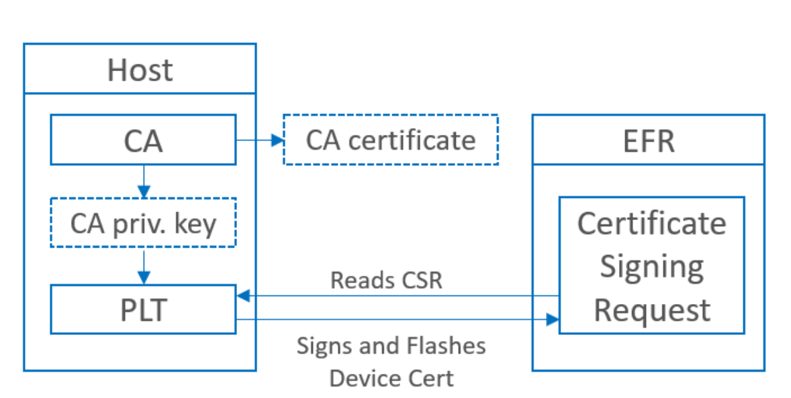
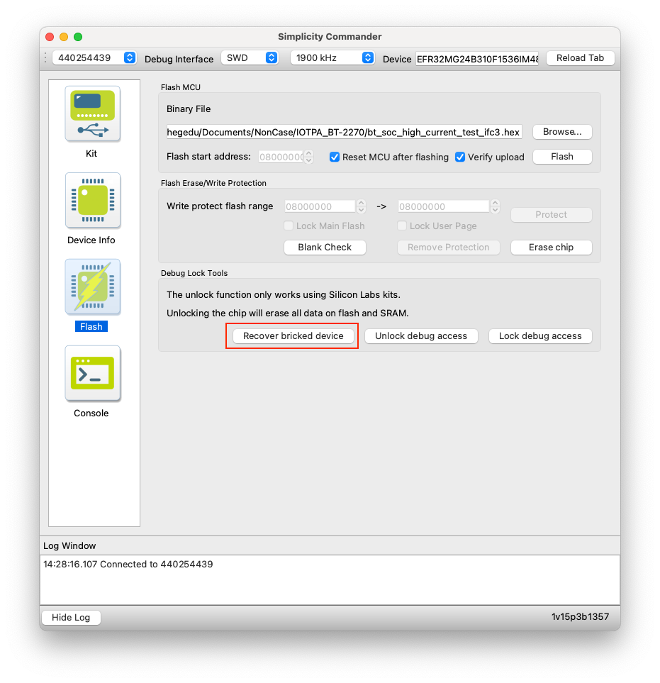
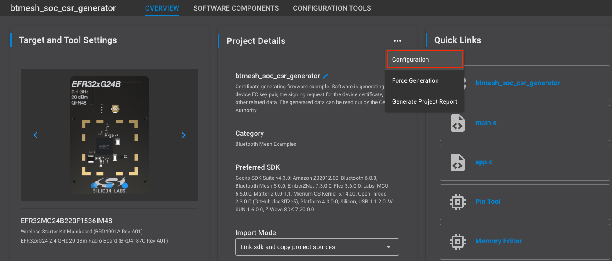
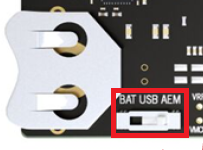

# Bluetooth Mesh - SoC CSR Generator (Secure Vault)

The Bluetooth Mesh - SoC CSR Generator sample app generates the private key and the device certificate signing request on the device. It can also be used to connect to the certificate authority and send over the device certificate signing request to be signed.

## Getting Started

Certificate-Based Provisioning (CBP) is defined in Bluetooth Mesh protocol specification version 1.1. Certificate-Based Provisioning makes mesh networks more secure by establishing an identity using a signed certificate chain. This can prevent the possibility of rogue devices joining the network by spoofing the advertisement of a legitimate device. Certificate-Based Provisioning mitigates this by requiring the device to present a signed certificate or chain of certificates which can be verified using standard
public key cryptography.

Certificate-Based Provisioning is supported by the following devices:

| Device     | Support      |
|------------|--------------|
| EFR32xG21B | Secure Vault |
| EFR32xG24B | Secure Vault |

> ⚠ **The method described here is only intended for evaluation and should not be used in a production environment.**

To generate the device certificate and get it signed, follow this process:

1. Factory-reset your device to make sure that no keys and certificates are stored on it. You can do this with Simplicity Commander
using the Recover Bricked Device option in the GUI or with the following CLI command: `commander device recover`.

2. Flash an Internal Storage Bootloader to your device. (Must be generated and built as a separate project.) See [UG489: Silicon Labs Gecko Bootloader User's Guide for GSDK 4.0 and Higher](https://cn.silabs.com/documents/public/user-guides/ug489-gecko-bootloader-user-guide-gsdk-4.pdf) for specific instructions.
3. Create a new **Bluetooth Mesh - SoC CSR Generator (Secure Vault)** project in Simplicity Studio.
4. Open the slcp file of the project.
5. On the **Overview** tab, under **Project Details**, open the three-dots-menu, and click the **Configuration** button as shown below.

6. Modify the **Certification Subject Data** fields so that your certificate subject contains your company’s information.

7. Build and flash the project to your device. This will automatically generate the private-public key pair and the certificate signing
request on startup.
8. For continuation, please, see the **Bluetooth Mesh - SoC Empty with Certificate-Based Provisioning Support** example readme.

## Troubleshooting

Note that Software Example-based projects do not include a bootloader. However, they are configured to expect a bootloader to be present on the device. To install a bootloader, from the Launcher perspective's EXAMPLE PROJECTS & DEMOS tab either build and flash one of the bootloader examples or run one of the precompiled demos. Precompiled demos flash a bootloader as well as the application image.

- To flash an OTA DFU-capable bootloader to the device, flash the **Bluetooth Mesh - SoC Switch** demo.
- To flash a UART DFU-capable bootloader to the device, flash the **Bluetooth Mesh - NCP Empty** demo.
- For other bootloader types, create your own bootloader project and flash it to the device before flashing your application.
- When you flash your application image to the device, use the *.hex* or *.s37* output file. Flashing *.bin* files may overwrite (erase) the bootloader.
- For more information, see [UG103.6: Bootloader Fundamentals](https://www.silabs.com/documents/public/user-guides/ug103-06-fundamentals-bootloading.pdf) and [UG489: Silicon Labs Gecko Bootloader User's Guide for GSDK 4.0 and Higher](https://cn.silabs.com/documents/public/user-guides/ug489-gecko-bootloader-user-guide-gsdk-4.pdf).

Before programming the radio board mounted on the mainboard, make sure the power supply switch the AEM position (right side) as shown below.

## Resources

[Bluetooth Documentation](https://docs.silabs.com/bluetooth/latest/)

[Bluetooth Mesh Network - An Introduction for Developers](https://www.bluetooth.com/wp-content/uploads/2019/03/Mesh-Technology-Overview.pdf)

[QSG176: Bluetooth Mesh SDK v2.x Quick Start Guide](https://www.silabs.com/documents/public/quick-start-guides/qsg176-bluetooth-mesh-sdk-v2x-quick-start-guide.pdf)

[AN1315: Bluetooth Mesh Device Power Consumption Measurements](https://www.silabs.com/documents/public/application-notes/an1315-bluetooth-mesh-power-consumption-measurements.pdf)

[AN1316: Bluetooth Mesh Parameter Tuning for Network Optimization](https://www.silabs.com/documents/public/application-notes/an1316-bluetooth-mesh-network-optimization.pdf)

[AN1317: Using Network Analyzer with Bluetooth Low Energy ® and Mesh](https://www.silabs.com/documents/public/application-notes/an1317-network-analyzer-with-bluetooth-mesh-le.pdf)

[AN1318: IV Update in a Bluetooth Mesh Network](https://www.silabs.com/documents/public/application-notes/an1318-bluetooth-mesh-iv-update.pdf)

[UG295: Silicon Labs Bluetooth Mesh C Application Developer's Guide for SDK v2.x](https://www.silabs.com/documents/public/user-guides/ug295-bluetooth-mesh-dev-guide.pdf)

[UG472: Silicon Labs Bluetooth ® C Application Developer's Guide for SDK v3.x](https://www.silabs.com/documents/public/user-guides/ug434-bluetooth-c-soc-dev-guide-sdk-v3x.pdf)

[Bluetooth Training](https://www.silabs.com/support/training/bluetooth)

## Report Bugs & Get Support

You are always encouraged and welcome to report any issues you found to us via [Silicon Labs Community](https://www.silabs.com/community).
